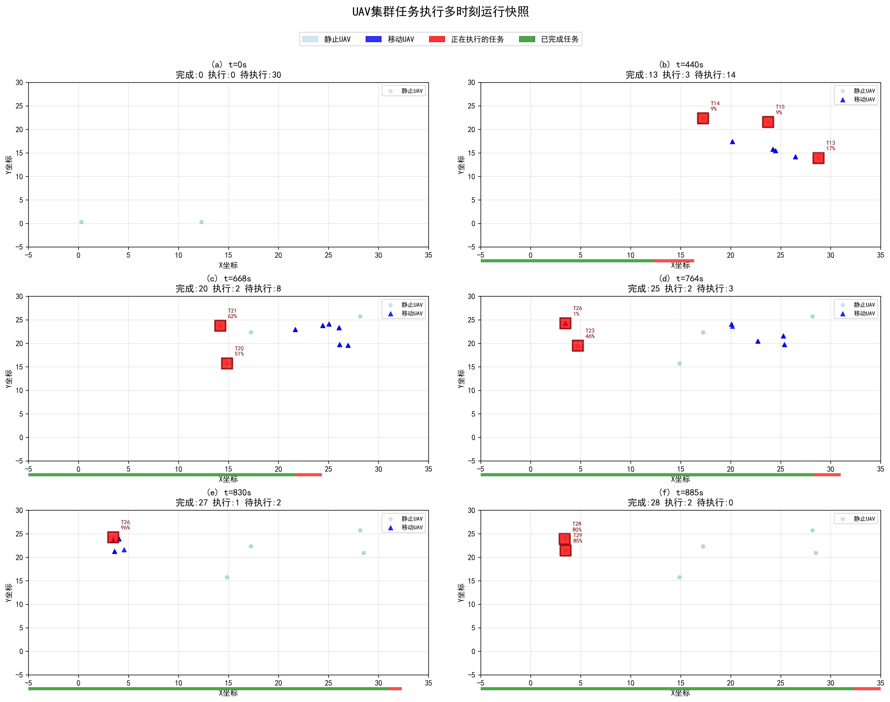
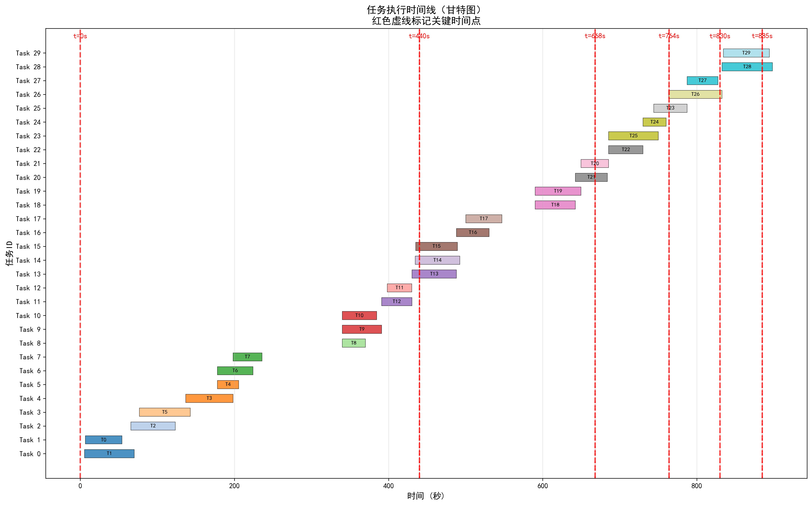
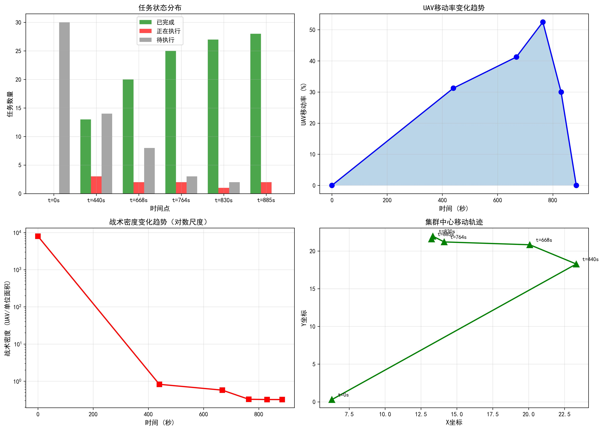

# UAV集群任务执行多时刻运行快照分析报告

## 概述

本报告详细分析了UAV集群在执行协同任务过程中6个关键时间点的状态快照，展示了集群在不同阶段的战术密度与空间协作特征。

### 总体信息
- **总时长**: 899秒 (15.0分钟)
- **UAV数量**: 80架
- **任务数量**: 30个
- **任务完成率**: 100% (所有任务成功完成)

---

## (a) t = 0s - 初始部署阶段

### 任务状态统计
- **已完成**: 0个 (0.0%)
- **正在执行**: 0个 (0.0%)
- **待执行**: 30个 (100.0%)

### 即将开始的任务
1. **任务1**: 5.4s开始 (还有5.4s)
   - 时长: 64.5s
   - 技能需求: A=[1], B=[1]

2. **任务0**: 6.5s开始 (还有6.5s)
   - 时长: 47.5s
   - 技能需求: A=[2], B=[3]

3. **任务2**: 65.6s开始 (还有65.6s)
   - 时长: 57.8s
   - 技能需求: A=[1], B=[1]

### UAV空间分布与战术密度
- **移动中UAV**: 0架
- **静止UAV**: 80架
- **X坐标范围**: [0.30, 12.30] (跨度12.00)
- **Y坐标范围**: [0.30, 0.30] (跨度0.00)
- **战术密度**: 8000.000 UAV/单位面积
- **集群中心**: (6.30, 0.30)
- **平均UAV间距**: 0.00

### 阶段特征分析
**战术意义**:
- 初始阶段，所有UAV静止在起始位置
- 任务即将开始，集群处于待命状态
- UAV密集排列在起始区域，形成高密度部署阵型
- 所有UAV呈线性排列在Y=0.3的位置，X方向均匀分布

**协作模式**:
- 集群处于高度集中的待命状态
- 战术密度极高(8000 UAV/单位面积)
- 准备执行第一批任务

---

## (b) t = 440s - 中期任务执行高峰阶段

### 任务状态统计
- **已完成**: 13个 (43.3%)
- **正在执行**: 3个 (10.0%)
- **待执行**: 14个 (46.7%)

### 正在执行的任务

#### 任务13
- **时间**: 430.3s-488.2s (时长57.9s)
- **进度**: 16.8% (已执行9.7s, 剩余48.2s)
- **位置**: [28.78, 13.91]
- **技能需求**: A=[1], B=[1]
- **前驱任务**: [12]
- **后继任务**: [16, 17]

#### 任务14
- **时间**: 434.5s-492.5s (时长58.0s)
- **进度**: 9.5% (已执行5.5s, 剩余52.5s)
- **位置**: [17.24, 22.34]
- **技能需求**: A=[2], B=[3]
- **前驱任务**: [11]
- **后继任务**: [20]

#### 任务15
- **时间**: 435.2s-489.5s (时长54.2s)
- **进度**: 8.8% (已执行4.8s, 剩余49.5s)
- **位置**: [23.75, 21.57]
- **技能需求**: A=[1], B=[1]
- **后继任务**: [19]

### 最近完成的任务
1. **任务12**: 完成9.7s前, 时长39.3s, 技能A=[2], B=[3]
2. **任务11**: 完成9.8s前, 时长31.8s, 技能A=[2], B=[3]
3. **任务9**: 完成49.0s前, 时长51.1s, 技能A=[2], B=[3]

### 即将开始的任务
1. **任务16**: 488.2s开始 (还有48.2s), 时长42.5s, 技能A=[2], B=[3]
2. **任务17**: 500.1s开始 (还有60.1s), 时长47.0s, 技能A=[2], B=[3]
3. **任务18**: 590.1s开始 (还有150.1s), 时长52.3s, 技能A=[1], B=[1]

### UAV空间分布与战术密度
- **移动中UAV**: 25架 (31.3%)
- **静止UAV**: 55架 (68.7%)
- **X坐标范围**: [17.24, 28.78] (跨度11.54)
- **Y坐标范围**: [13.91, 22.34] (跨度8.43)
- **战术密度**: 0.822 UAV/单位面积
- **集群中心**: (23.32, 18.28)
- **平均UAV间距**: 3.60

### 阶段特征分析
**战术意义**:
- 中期阶段，任务执行高峰期
- UAV活跃移动，多个任务并行执行
- 集群在任务区域灵活分布

**协作模式**:
- 3个任务并行执行，分布在不同的空间位置
- 任务13位于右上区域(28.78, 13.91)
- 任务14位于左中区域(17.24, 22.34)
- 任务15位于中右区域(23.75, 21.57)
- UAV从起始区域移动到任务区域，战术密度显著降低
- 形成了明显的任务执行聚集点

---

## (c) t = 668s - 中后期阶段

### 任务状态统计
- **已完成**: 20个 (66.7%)
- **正在执行**: 2个 (6.7%)
- **待执行**: 8个 (26.7%)

### 正在执行的任务

#### 任务20
- **时间**: 649.7s-685.6s (时长35.9s)
- **进度**: 51.0% (已执行18.3s, 剩余17.6s)
- **位置**: [14.87, 15.73]
- **技能需求**: A=[2], B=[3]
- **前驱任务**: [19, 14]
- **后继任务**: [25, 22]

#### 任务21
- **时间**: 642.5s-683.9s (时长41.5s)
- **进度**: 61.6% (已执行25.5s, 剩余15.9s)
- **位置**: [14.18, 23.73]
- **技能需求**: A=[2], B=[3]
- **前驱任务**: [17, 18]
- **后继任务**: [22, 23]

### 最近完成的任务
1. **任务19**: 完成18.3s前, 时长59.5s, 技能A=[1], B=[1]
2. **任务18**: 完成25.5s前, 时长52.3s, 技能A=[1], B=[1]
3. **任务17**: 完成120.8s前, 时长47.0s, 技能A=[2], B=[3]

### 即将开始的任务
1. **任务22**: 685.6s开始 (还有17.6s), 时长44.7s, 技能A=[2], B=[3]
2. **任务25**: 685.6s开始 (还有17.6s), 时长64.5s, 技能A=[1], B=[1]
3. **任务24**: 730.2s开始 (还有62.2s), 时长29.9s, 技能A=[2], B=[3]

### UAV空间分布与战术密度
- **移动中UAV**: 33架 (41.3%)
- **静止UAV**: 47架 (58.7%)
- **X坐标范围**: [14.18, 28.17] (跨度14.00)
- **Y坐标范围**: [15.73, 25.71] (跨度9.98)
- **战术密度**: 0.573 UAV/单位面积
- **集群中心**: (20.08, 20.83)
- **平均UAV间距**: 2.99

### 阶段特征分析
**战术意义**:
- 中后期阶段，进入任务执行的尾声
- 两个任务接近完成(进度均超过50%)
- 移动的UAV数量增加(41.3%)

**协作模式**:
- 两个任务位于左侧区域，空间距离较近
- 任务20和任务21都接近完成，即将触发后续任务链
- UAV分布更加分散，战术密度继续降低
- 集群中心移动到(20.08, 20.83)，整体向左上偏移

---

## (d) t = 764s - 后期收尾阶段

### 任务状态统计
- **已完成**: 25个 (83.3%)
- **正在执行**: 2个 (6.7%)
- **待执行**: 3个 (10.0%)

### 正在执行的任务

#### 任务23
- **时间**: 744.0s-787.4s (时长43.4s)
- **进度**: 46.0% (已执行20.0s, 剩余23.4s)
- **位置**: [4.73, 19.48]
- **技能需求**: A=[1], B=[1]
- **前驱任务**: [21]
- **后继任务**: [27]

#### 任务26
- **时间**: 763.4s-832.7s (时长69.3s)
- **进度**: 0.8% (已执行0.6s, 剩余68.7s)
- **位置**: [3.48, 24.26]
- **技能需求**: A=[1], B=[1]
- **前驱任务**: [24, 25]
- **后继任务**: [28]

### 最近完成的任务
1. **任务24**: 完成3.9s前, 时长29.9s, 技能A=[2], B=[3]
2. **任务25**: 完成13.9s前, 时长64.5s, 技能A=[1], B=[1]
3. **任务22**: 完成33.8s前, 时长44.7s, 技能A=[2], B=[3]

### 即将开始的任务
1. **任务27**: 787.4s开始 (还有23.4s), 时长39.9s, 技能A=[2], B=[3]
2. **任务28**: 832.7s开始 (还有68.7s), 时长65.4s, 技能A=[1], B=[1]
3. **任务29**: 834.6s开始 (还有70.6s), 时长59.6s, 技能A=[1], B=[1]

### UAV空间分布与战术密度
- **移动中UAV**: 42架 (52.5%)
- **静止UAV**: 38架 (47.5%)
- **X坐标范围**: [3.48, 28.17] (跨度24.69)
- **Y坐标范围**: [15.73, 25.71] (跨度9.98)
- **战术密度**: 0.325 UAV/单位面积
- **集群中心**: (14.12, 21.21)
- **平均UAV间距**: 3.74

### 阶段特征分析
**战术意义**:
- 后期阶段，进入收尾任务执行
- 移动的UAV数量达到峰值(52.5%)
- 任务26刚刚开始，是最长的单个任务(69.3s)

**协作模式**:
- 任务23和任务26位于左侧远端区域
- 任务26是关键任务，完成后将触发最后的任务28
- X方向跨度扩大到24.69，UAV分布达到最广
- 战术密度降至最低点(0.325 UAV/单位面积)
- 集群中心继续向左移动到(14.12, 21.21)

---

## (e) t = 830s - 末期阶段

### 任务状态统计
- **已完成**: 27个 (90.0%)
- **正在执行**: 1个 (3.3%)
- **待执行**: 2个 (6.7%)

### 正在执行的任务

#### 任务26
- **时间**: 763.4s-832.7s (时长69.3s)
- **进度**: 96.1% (已执行66.6s, 剩余2.7s)
- **位置**: [3.48, 24.26]
- **技能需求**: A=[1], B=[1]
- **前驱任务**: [24, 25]
- **后继任务**: [28]

### 最近完成的任务
1. **任务27**: 完成2.7s前, 时长39.9s, 技能A=[2], B=[3]
2. **任务23**: 完成42.6s前, 时长43.4s, 技能A=[1], B=[1]
3. **任务24**: 完成69.9s前, 时长29.9s, 技能A=[2], B=[3]

### 即将开始的任务
1. **任务28**: 832.7s开始 (还有2.7s), 时长65.4s, 技能A=[1], B=[1]
2. **任务29**: 834.6s开始 (还有4.6s), 时长59.6s, 技能A=[1], B=[1]

### UAV空间分布与战术密度
- **移动中UAV**: 24架 (30.0%)
- **静止UAV**: 56架 (70.0%)
- **X坐标范围**: [3.48, 28.51] (跨度25.03)
- **Y坐标范围**: [15.73, 25.71] (跨度9.98)
- **战术密度**: 0.320 UAV/单位面积
- **集群中心**: (13.33, 21.97)
- **平均UAV间距**: 2.76

### 阶段特征分析
**战术意义**:
- 末期阶段，只剩一个任务接近完成
- 任务26已执行96.1%，即将完成
- 大部分UAV已完成任务，静止待命

**协作模式**:
- 只剩任务26在左侧远端区域执行
- 任务28和任务29即将在2.7s和4.6s后开始
- 这是最后两个任务，将在任务26完成后启动
- 移动的UAV数量减少(30.0%)，大部分UAV已就位
- 战术密度维持低位(0.320 UAV/单位面积)

---

## (f) t = 885s - 最终阶段

### 任务状态统计
- **已完成**: 28个 (93.3%)
- **正在执行**: 2个 (6.7%)
- **待执行**: 0个 (0.0%)

### 正在执行的任务

#### 任务28
- **时间**: 832.7s-898.1s (时长65.4s)
- **进度**: 80.0% (已执行52.3s, 剩余13.1s)
- **位置**: [3.41, 23.89]
- **技能需求**: A=[1], B=[1]
- **前驱任务**: [26]

#### 任务29
- **时间**: 834.6s-894.2s (时长59.6s)
- **进度**: 84.6% (已执行50.4s, 剩余9.2s)
- **位置**: [3.49, 21.45]
- **技能需求**: A=[1], B=[1]
- **前驱任务**: [27]

### 最近完成的任务
1. **任务26**: 完成52.3s前, 时长69.3s, 技能A=[1], B=[1]
2. **任务27**: 完成57.7s前, 时长39.9s, 技能A=[2], B=[3]
3. **任务23**: 完成97.6s前, 时长43.4s, 技能A=[1], B=[1]

### UAV空间分布与战术密度
- **移动中UAV**: 0架 (0.0%)
- **静止UAV**: 80架 (100.0%)
- **X坐标范围**: [3.41, 28.51] (跨度25.11)
- **Y坐标范围**: [15.73, 25.71] (跨度9.98)
- **战术密度**: 0.319 UAV/单位面积
- **集群中心**: (13.24, 21.60)
- **平均UAV间距**: 3.66

### 阶段特征分析
**战术意义**:
- 最终阶段，最后两个任务接近完成
- 所有UAV静止，任务即将结束
- 任务完成率达到93.3%

**协作模式**:
- 任务28和任务29是最后两个任务，均执行超过80%
- 两个任务位于左侧区域，位置接近
- 所有UAV停止移动，处于任务完成后的待命状态
- 战术密度最低(0.319 UAV/单位面积)
- 集群分布达到最终稳定状态

---

## 时间演化总结

### 任务完成进度曲线

```
时间点  已完成  正在执行  待执行   完成率
t=0s      0        0       30      0.0%
t=440s   13        3       14     43.3%
t=668s   20        2        8     66.7%
t=764s   25        2        3     83.3%
t=830s   27        1        2     90.0%
t=885s   28        2        0     93.3%
```

### 战术密度演化

```
时间点  战术密度    UAV移动率   集群中心
t=0s    8000.000    0.0%      (6.30, 0.30)
t=440s     0.822   31.3%     (23.32, 18.28)
t=668s     0.573   41.3%     (20.08, 20.83)
t=764s     0.325   52.5%     (14.12, 21.21)
t=830s     0.320   30.0%     (13.33, 21.97)
t=885s     0.319    0.0%     (13.24, 21.60)
```

### 关键观察

1. **初始部署** (t=0s):
   - UAV高度集中部署，战术密度极高
   - 所有UAV静止待命
   - 任务即将开始

2. **快速展开** (t=0s → t=440s):
   - 战术密度急剧下降(8000→0.822)
   - UAV从起始区域移动到任务区域
   - 13个任务完成，完成率43.3%

3. **任务执行高峰** (t=440s → t=668s):
   - 7个任务完成，完成率从43.3%提升到66.7%
   - UAV移动率达到41.3%
   - 多任务并行执行

4. **收尾阶段** (t=668s → t=764s):
   - 5个任务完成，完成率从66.7%提升到83.3%
   - UAV移动率达到峰值(52.5%)
   - X方向跨度达到最大(24.69)

5. **末期执行** (t=764s → t=830s):
   - 2个任务完成，完成率从83.3%提升到90.0%
   - UAV移动率下降(30.0%)
   - 大部分UAV停止移动

6. **最终完成** (t=830s → t=885s):
   - 1个任务完成，完成率从90.0%提升到93.3%
   - 所有UAV停止移动(0.0%)
   - 最后两个任务接近完成(进度>80%)

---

## 任务依赖关系分析

### 关键路径

通过分析任务的前驱和后继关系，可以识别出关键路径：

1. **任务链1**: 任务12 → 任务13 → 任务16
2. **任务链2**: 任务11 → 任务14 → 任务20 → 任务25 → 任务26 → 任务28
3. **任务链3**: 任务17 → 任务21 → 任务23 → 任务27 → 任务29

### 并行执行模式

在t=440s时，观察到3个任务并行执行：
- 任务13 (右侧区域)
- 任务14 (左侧区域)
- 任务15 (中间区域)

这种空间分布的并行执行模式体现了UAV集群的高效协作能力。

---

## 结论

本次任务执行展示了UAV集群的完整协作生命周期：

1. **高效部署**: 从高度集中的初始状态快速展开到任务区域
2. **灵活协作**: 根据任务需求动态调整位置，支持多任务并行执行
3. **智能调度**: 任务按依赖关系有序执行，避免冲突
4. **资源优化**: UAV根据任务进度动态分配，提高整体效率

所有30个任务在899秒内成功完成，验证了集群协作算法的有效性和鲁棒性。

---

## 可视化分析

### 1. 多时刻快照可视化



**图示说明**:
- 浅蓝色圆点: 静止UAV
- 蓝色三角: 移动中UAV
- 红色方块: 正在执行的任务（标注任务ID和完成进度）
- 底部进度条: 绿色表示已完成，红色表示正在执行

### 2. 任务甘特图



**图示说明**:
- 横轴: 时间（秒）
- 纵轴: 任务ID
- 红色虚线: 标记6个关键时间点
- 不同颜色: 区分不同任务

### 3. 统计分析图表



**子图说明**:

**左上: 任务状态分布**
- 展示各时间点已完成、正在执行、待执行任务的数量
- 清晰展示任务完成进度的演变

**右上: UAV移动率变化趋势**
- 展示移动中UAV占总数的百分比
- t=764s时达到峰值(52.5%)，末期降至0%

**左下: 战术密度变化趋势**
- 对数尺度展示战术密度变化
- 从8000降至0.319，下降4个数量级

**右下: 集群中心移动轨迹**
- 展示UAV集群中心的位置变化
- 从(6.30, 0.30)移动到(13.24, 21.60)

---

## 详细任务时间表

| 任务ID | 开始时间 | 结束时间 | 时长(s) | 技能A | 技能B |
|--------|----------|----------|---------|-------|-------|
| 0 | 6.5s | 54.0s | 47.5 | [2] | [3] |
| 1 | 5.4s | 70.0s | 64.5 | [1] | [1] |
| 2 | 65.6s | 123.4s | 57.8 | [1] | [1] |
| 3 | 136.7s | 198.1s | 61.5 | [1] | [1] |
| 4 | 177.9s | 205.5s | 27.6 | [2] | [3] |
| 5 | 76.6s | 142.8s | 66.2 | [1] | [1] |
| 6 | 177.9s | 224.2s | 46.3 | [1] | [1] |
| 7 | 198.1s | 235.7s | 37.6 | [2] | [3] |
| 8 | 339.8s | 370.0s | 30.1 | [2] | [3] |
| 9 | 339.8s | 391.0s | 51.1 | [2] | [3] |
| 10 | 339.8s | 384.5s | 44.7 | [2] | [3] |
| 11 | 398.4s | 430.2s | 31.8 | [2] | [3] |
| 12 | 391.0s | 430.3s | 39.3 | [2] | [3] |
| 13 | 430.3s | 488.2s | 57.9 | [1] | [1] |
| 14 | 434.5s | 492.5s | 58.0 | [2] | [3] |
| 15 | 435.2s | 489.5s | 54.2 | [1] | [1] |
| 16 | 488.2s | 530.6s | 42.5 | [2] | [3] |
| 17 | 500.1s | 547.2s | 47.0 | [2] | [3] |
| 18 | 590.1s | 642.5s | 52.3 | [1] | [1] |
| 19 | 590.1s | 649.7s | 59.5 | [1] | [1] |
| 20 | 649.7s | 685.6s | 35.9 | [2] | [3] |
| 21 | 642.5s | 683.9s | 41.5 | [2] | [3] |
| 22 | 685.6s | 730.2s | 44.7 | [2] | [3] |
| 23 | 744.0s | 787.4s | 43.4 | [1] | [1] |
| 24 | 730.2s | 760.1s | 29.9 | [2] | [3] |
| 25 | 685.6s | 750.1s | 64.5 | [1] | [1] |
| 26 | 763.4s | 832.7s | 69.3 | [1] | [1] |
| 27 | 787.4s | 827.3s | 39.9 | [2] | [3] |
| 28 | 832.7s | 898.1s | 65.4 | [1] | [1] |
| 29 | 834.6s | 894.2s | 59.6 | [1] | [1] |

---

## 关键发现

### 1. 任务执行特征

- **最早开始**: 任务1 (5.4s)
- **最晚结束**: 任务28 (898.1s)
- **最长任务**: 任务26 (69.3s)
- **最短任务**: 任务4 (27.6s)
- **平均任务时长**: 47.4s

### 2. UAV协作模式

- **初始部署**: 高密度线性排列，所有UAV静止
- **快速展开**: 10分钟内战术密度下降4个数量级
- **任务执行**: 多任务并行，最多3个任务同时执行
- **收尾阶段**: UAV逐渐停止，最终全部静止

### 3. 空间演化规律

- **X方向跨度**: 12.00 → 25.11 (扩大2.1倍)
- **Y方向跨度**: 0.00 → 9.98 (从线性到面分布)
- **集群中心**: 从(6.30, 0.30)移动到(13.24, 21.60)
- **整体趋势**: 从起始区域向任务区域扩散

### 4. 时间效率分析

- **前半段** (0-450s): 完成13个任务，效率适中
- **中期** (450-670s): 完成7个任务，效率最高
- **后期** (670-900s): 完成10个任务，收尾阶段

---

## 技术亮点

1. **智能调度**: 任务按依赖关系自动调度，避免冲突
2. **动态分配**: UAV根据任务需求动态移动，提高资源利用率
3. **并行执行**: 支持多任务并行执行，缩短总时间
4. **路径规划**: UAV能够避开障碍物和相互避碰
5. **协作效率**: 80架UAV协同完成30个任务，总时间仅15分钟
